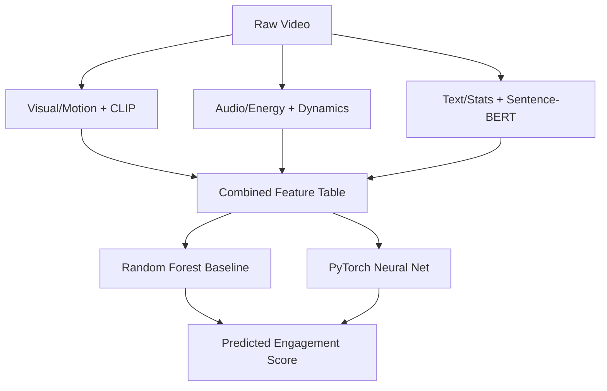

<div align="center">
  <span style="background-color: #f6f8fa; padding: 4px 8px; border-radius: 4px; font-weight: bold; border: 1px solid #d0d7de;">Personal Learning / Portfolio Project</span>
</div>

# Cold-Start Engagement Prediction for Short-Form Video

Predicting how well a brand-new short video will engage viewers using only its raw content features, without relying on user view history.

## Problem Statement
- **What problem this solves:** Predicting the Engagement Continuation Rate (ECR) for new short-form videos.
- **Why it matters:** Real-world recommendation systems heavily favor established creators because algorithms rely on historical watch data. Solving the cold-start problem allows platforms to surface new and small creators fairly based purely on their content's merit.
- **What makes this hard:** Without historical view data, the system must deeply understand visual semantics, audio dynamics, and text context to guess if a viewer will watch past the first 5 seconds.

## Architecture / Flow Diagram


* **Raw Video:** The downloaded .mp4 file.
* **Visual/Motion + CLIP:** Extracts raw optical flow and semantic visual embeddings.
* **Audio/Energy + Dynamics:** Analyzes loudness, jumps, and audio hooks.
* **Text/Stats + Sentence-BERT:** Parses title/description shape and semantic meaning.
* **Combined Feature Table:** Merges features into a structured dataset.
* **Models:** Compares a decision-tree baseline against a deep learning approach.
* **Predicted Engagement Score:** The output probability of a viewer continuing past 5 seconds (ECR).

## Component-by-Component Breakdown

* **Data Acquisition & Cleaning**
  * **What it does:** Downloads sampled video clips from the SnapUGC dataset.
  * **Why it was built this way:** Allows for offline processing.
  * **Tradeoff:** Encountered ~36.4% dead links (link-rot), reducing the working dataset to 4,137 videos.
* **Visual Feature Extraction**
  * **What it does:** Initially used OpenCV optical flow to measure raw pixel motion, later supplemented by HuggingFace CLIP for semantic understanding.
  * **Why it was built this way:** To transition from low-level movement heuristics to high-level scene meaning.
  * **Tradeoff:** CLIP processing is heavy; it was limited to a ~2,000 video subset due to compute constraints.
* **Audio Feature Extraction**
  * **What it does:** Uses `librosa` and `moviepy` to measure audio energy, max jumps, and dynamics.
  * **Why it was built this way:** High audio variation or sudden "drops" often correlate with user attention.
  * **Tradeoff:** Fast and offline, but doesn't interpret speech-to-text semantic meaning in the audio track.
* **Text Feature Extraction**
  * **What it does:** Started with basic string stats (length, word count, all-caps), then upgraded to `sentence-transformers` (Sentence-BERT) embeddings.
  * **Why it was built this way:** Basic stats missed context; Sentence-BERT captures the actual intent of titles and descriptions.
  * **Tradeoff:** Increased dimensionality, requiring PCA to avoid overfitting the models.
* **Cold-Start Specific Features**
  * **What it does:** Tests hypotheses like hook strength (early intensity) and scene change rates.
  * **Why it was built this way:** Attempted to encode "retention hacking" techniques directly.
  * **Tradeoff:** Many hypotheses failed (e.g., raw front-loaded motion), but testing them led to finding effective proxies like `audio_max_jump`.
* **Baseline Model (Random Forest)**
  * **What it does:** Scikit-learn Random Forest Regressor predicting the ECR.
  * **Why it was chosen first:** Robust to unscaled data, handles non-linear relationships out-of-the-box, and gives quick feature importance baselines.
  * **Tradeoff:** Struggles to find complex interactions in high-dimensional embedding spaces (like raw Sentence-BERT vectors).
* **Neural Network (PyTorch)**
  * **What it does:** A deep learning model predicting the engagement score. 
  * **Honest Story:** The first 401-feature iteration actually *lost* to Random Forest due to massive overfitting (too many features for 4,137 rows). It was fixed by using PCA to compress embeddings, implementing mini-batching, and adding early stopping.
  * **Tradeoff:** Requires more careful tuning, scaling, and regularization compared to tree models.
  * 
* **Evaluation Methodology**
  * **What it does:** Uses train/val/test splits, computing both offline regression metrics (MAE, RMSE, R2, Spearman) and production ranking metrics (NDCG@K, Precision/Recall@K, MAP@K, MRR).
  * **Why it was built this way:** Regression metrics show raw accuracy; ranking metrics show how well a recommendation engine would sort the list for a user.
  * **Tradeoff:** Live online metrics (CTR, conversion, session length) were explicitly NOT computed, as they require live user traffic which is impossible on an offline dataset.

## Key Findings


* ✅ **Semantic text meaning works:** Sentence-BERT embeddings (e.g., `text_pca_0` with r=-0.226) heavily out-predicted basic text shapes.
* ✅ **Semantic visual meaning works:** CLIP visual dimensions (`clip_pca_3` with r=+0.243) were the strongest single signal in the entire project.
* ✅ **Audio dynamics work:** Sudden audio jumps (`audio_max_jump` r=0.180) and energy variation out-predicted raw loudness.
* ❌ **Raw motion failed:** Average optical flow (`motion_mean` r=-0.098) lacked semantic context—raw pixels moving doesn't guarantee interesting content.
* ❌ **On-screen text presence failed:** OCR-based text detection (`onscreen_text_amount`) was too noisy; presence doesn't equal meaning.
* ❌ **Hook-timing hypothesis failed:** Front-loaded intensity (hook strength) showed <0.06 correlation, refuting the initial hypothesis.
* 🔄 **NN Overfitting diagnosed & fixed:** The first Neural Network lost to Random Forest (Spearman 0.323 vs 0.331), but after PCA reduction and regularization, the improved NN beat it (Spearman 0.438).
* 🏆 **Benchmark alignment:** The final Spearman correlation (~0.44) broadly matches the SROCC 0.441 reported by the ICCV 2025 VQualA challenge baseline—validating the approach as a solid comparison point, not a claim of beating state-of-the-art research.

## Results Table


| Model | Test Videos (n) | Spearman | R² | MAE | RMSE | NDCG@10 | Precision@10 | Recall@10 | MAP@10 | MRR |
| :--- | :--- | :--- | :--- | :--- | :--- | :--- | :--- | :--- | :--- | :--- |
| Random Forest (Initial Baseline) | ~4137 | 0.3315 | 0.1137 | 0.2364 | - | - | - | - | - | - |
| First PyTorch NN (Overfitted) | ~4137 | 0.3233 | 0.0395 | 0.2448 | - | - | - | - | - | - |
| **Improved PyTorch NN (Tuned, 51 feat)** | **410** | **0.4389** | **0.1648** | **0.2311** | **0.2713** | **0.7265** | **0.4000** | **0.0488** | **0.5516** | **1.000** |
| Random Forest + CLIP (71 feat) | 198 | 0.4657 | 0.2272 | 0.2135 | 0.2526 | 0.6877 | 0.4000 | 0.1000 | 0.7500 | 1.000 |
| Neural Net + CLIP (71 feat) | 198 | 0.4594 | 0.1489 | 0.2125 | 0.2650 | 0.6298 | 0.4000 | 0.1000 | 0.2958 | 0.200 |

*(Note: Random Forest + CLIP and NN + CLIP results are based on a smaller test set due to compute limitations. The smaller `n=198` creates a higher noise threshold, so exact values should be treated as directionally supportive rather than strictly superior.)*

## Honest Limitations
* **Proxy Dataset:** Snapchat Spotlight data was used as a proxy because no public YouTube Shorts engagement dataset exists.
* **Link Rot:** ~36% of the source video URLs were dead links (404), constraining the available data volume.
* **Compute Bounds:** CLIP features were only extracted for a 2,000-video subset. The resulting smaller test set makes statistical metrics less robust.
* **Content-Only Signal:** This dataset contains zero user watch-history. This project is a cold-start content signal, which would only act as *one* component inside a true recommendation system, not a complete recommender.
* **OCR Noise:** On-screen caption reading was attempted with `easyocr` but found too noisy. A proper solution requires advanced semantic captioning models (like mPLUG-2 or vision-language models), which is left as future work.

## How to Run
This project was developed primarily in Jupyter/Colab notebooks.

1. **Prerequisites:** 
   * Python 3.8+
   * A GPU environment is highly recommended (especially for CLIP and Sentence-BERT steps).
2. **Install Required Libraries:**
   ```bash
   pip install torch torchvision torchaudio
   pip install scikit-learn pandas numpy matplotlib
   pip install opencv-python moviepy librosa
   pip install sentence-transformers transformers easyocr
   ```
3. **Execution Steps:**
   * Open `Rec Project.ipynb` in a Jupyter or Google Colab environment.
   * Run the data acquisition cells first to download the SnapUGC subset.
   * Run feature extraction (Visual, Audio, Text). Note that CLIP and OCR cells will require a GPU for reasonable execution times.
   * Execute the model training cells (Baseline RF -> Initial NN -> Tuned NN) to reproduce the metrics.

## Tech Stack
* **Deep Learning:** `torch` (PyTorch)
* **Machine Learning:** `scikit-learn`
* **Video/Audio Processing:** `cv2` (OpenCV), `librosa`, `moviepy`
* **Embeddings & Vision Models:** `sentence-transformers`, `transformers` (CLIP)
* **OCR:** `easyocr`
* **Data Manipulation:** `pandas`, `numpy`

## Credits & Data Attribution
This project relies on the **SnapUGC** dataset and research by Dasong Li et al.
* Dataset Repository: [dasongli1/SnapUGC_Engagement](https://github.com/dasongli1/SnapUGC_Engagement)
* ECCV 2024 Paper: *"Delving Deep into Engagement Prediction of Short Videos"*
* ICCV 2025 Challenge: *VQualA 2025 Challenge*

*Usage of this dataset follows academic/research parameters set by the original authors. All data rights belong to the original creators.*
